# `plantuml-stdlib`
Contains official Standard Library for PlantUML.
_See http://plantuml.com/stdlib for more information._

This Standard Library is included in official release of PlantUML.
Following the C convention for "C standard library" _(see https://en.wikipedia.org/wiki/C_standard_library)_

# List of current `stdlib` include on PlantUML

[](https://editor.plantuml.com/uml/SoWkIImgAStDuUKgBad9oKpYvN98pKi12W00)

## AdaML [ada]

### What is AdaML
- UML tailored for Ada 2012 programming language
- A modeling language to draw UML diagrams, implemented in PlantUML
- An easy way to learn Ada through the use of UML and OOP concepts

### Features
- UML tailored to use and show particular Ada language characteristics
- Coherent set of functions to design software components for Ada
- Generates high quality drawings (ps, eps) easy to embedded in other docs
- Easy to learn by example, both AdaML and Ada language

Example of usage:
```plantuml
!include <AdaML/AdaML>
actor User
agent String_Instrument
agent Screen
agent Touch_Screen
agent Microphone

begin_package_spec("Floyd_Tuner")

  subprogram("Main")

  package("View")
  package("Controller")
  package("Signal_Analyzer")
  package("Sample_Collector")

  depends("User", "Touch_Screen", "interacts >")
  depends("Main", "Controller", "starts >")
  depends("User", "Screen", "see")
  depends("User", "String_Instrument", "plays\n&\ntunes")

  depends("Touch_Screen", "Controller", "commands")

  depends("Controller", "Sample_Collector", "manages")
  depends("Controller", "Signal_Analyzer", "configures")
  depends("Controller", "View", "commands")

  depends("View", "Screen", "output >")
  depends("View", "Signal_Analyzer", "read\nresults >")
  depends("Signal_Analyzer", "Sample_Collector", "read\nsamples >")
  depends("Sample_Collector", "Microphone", "ADC")

  depends("String_Instrument", "Microphone", "captures <")

end()
```

This example renders the following image:
![Example](https://www.plantuml.com/plantuml/png/p5PTRnkx4NtNhnZVuC8E8CkotQPnumILLJiHuCY693Vmap1Q3dTPSya5oPMi5ltl9RMIg5shyOjJN0g8mZc7PpuuG-jlrg5nPIvRXt3yPWiElTmRhagkn_3xBHo7xsE7Gcf331wyATUCf50ftA9AIqp9axgTqyxPJ-NwkbWQaMOEZlhluQnxUj7s_vvruSQWIiWcCD99HWPUMxyasKacB1H6fmPp41Qu8GAhkLkWeKy0Irr2WWeCCM6T4RFI4GW7gDY9Dg4aWY-Zd4TAnSY08vDRq1nSHl1r-01VIP512VVbJ8e4RaL2oXAWznuiDYC6isKZkd3u9aGqNaS4SAEz0tH2gpQGy0G3SpBMx-5yxQyIPzG6RMfoH-X2GjweYw3m7b0jGQAB8ft0_cDSHImu0w5MYMMw8FyVTA7G2o4bp0XAIxoKxQQSFmW_1fDlTmyJw0qVuKTlDEeD9u-V_46NQO_Id2fPaHTI40DVOOFABKCTctBVhqVzR_vyxsfmEvWyXjBU32R3w_4ORkv6q8FxtcWow3_SzaPm_p2wlnjVTm36H2iFJRcVjGHVzPKXO1J6ptR-_rVng4kmlaQIGOPp0aC9YJanG4ZyEB_UrtKvb5gbgxA3sxbadzY0WzAk3PO8BZFd2llNavF5Oj59LTdH9ZsHbPuz-TBvDSc-wMlSEXm_2GK5-kp8aR4jw_UhBVox1O36w4LVIsrW9Z5vsfXywoTFYgo5RkUZDyxqSu6CXRUswxU9H6jxRZqDWqIhiVWNmUaMk_9QgGalGoM-o8IZBQWD8rFtkWD4twUTymrqevMhVFnfrpJqQK7_-mDSLI_wc79nfINRSBuHUiLcDEyOXizFIPUNe6V_fCJ1bo_mZdFsbsxtjGE5qSwV8BR_g3299DRFqA0dcLVYRz9Z1Sxse2DaehG-1amIiZPu_lF_fAqlIkU5LkHLtL8IbBaCmemubjBj2swaSrHrIWme3MCdahyBMqXSWZCbUMk6YYsCS8uKS9Gss7AjT98PdTFMDDIENbmIz-lYOet6dl78-MhLaDWqdOyVrqW8S7tYRBMY_MLkb9OIpGuZTdImZ3DaUY5KMcLM6IVqx7fIf2edvK0ITnwehdutgZX6XSyHqpsfVWYVIAXkX8UXZSPzOOTUgJEgewPAfmx5-TdCSgY8tMPMtSP__AFnjRfCIBJY8csXb7enpSMpPxKomGWeBzmISFC2s5rhJYxJR6swlApguVknwiKNPkl8a7RBWbgM72YVeVL1qvZ2C-MqWOwFw5evuGHPwAz2AZqYj6eTuCowqDhJ94C3s_KPVklzjek6Ek-YlhlEptbtbnC3MNCyM4tJ5AtLYLYvt0YWb16lEw_m7JGwZ-wxuHCvqNbKM24xb99pyLoJcVOs7A6y0CU4wh5upg2ELh74GD2hSrxZn5YsTQYwA8f7WVjTD8h7CeT2HqvDFCfl7iuNqR-he_kZht6QqMyHpxBbp0FxqXX7T7yQIO8OEVlJS6YVcjeLwDPeJJlAN_24p_Y6KzUEyitG8pZPeFlbEV_WruQpLxvARVqxg78IGTj0AoSn-Wj4pkkSw6GZFqSZS2RfvQJE8rhF88xAnSKkPy-ajWxlN4Qc-JmmAaYnsdXvUcd9ow4nkAoDjeSq3rhtHipH4QHIpr32nh5j7KodkMRJgQTsmuPKcSTT-44PTmPLId6x_WCP3KNb91gOmSLK2aKssj0vix95KuAM6gRgoMqOusqqWD1aJTEoQ6gIf9oKirD9SvBHBjHqEyi59H5GseNhAvKZKrbz9O_VTBMgtzltey4_UfDhk7aOzYU3k-7Osz_QK-k0bofPjKMuEpTT_-evcgCigGthxNIrVTy2E10SZdwtpaXIHvKLFliY1CoZXbnfLFrOE4NIKeqH4SK4RuMlJIGlWveBAsP22hSyKfXNSKp5Qi8-m---0tmyAwGDtJQSRkFSS7p7_xUPQ-zjupZY__jJRBQDHLeKRSflGI9gAorWe2aAnEa_TKjSoBD5X3uIF2ggc-IxT-QtUyEzuMgvrPbnZ82wsvttpCxEFYudrlpoYmaQZdN37opZXPIj3KLt98E05hqLrZ6Z2QBkFU5UqLiUn39Uf8H5rYNLdjEoHqfJfJ8m6whF1iQtGdS2gSdynCx1e6srhDbQr49FBMIn5s36efNG4ICB6fcPWVlck65CJme846XsqG9M_QZAZaz2Po8neRslzSmJLshk6iMUZotzFdnuFdxuqFRtCSFKEYrdr-iInAX6wm4fp8J6I2wKzp0R6gFoeJ4w8w99vKHZObdH69KNfL5dHcEYkT4ObHrLbywFnaY6L8sn70dpYSsK_TmEIe_f38mRbvn49Swu8nWzmo60w6yO70yUq7_0I_8I4_M4lBRcXHcP-_T3s63mHkmykdTo8fAacCCLchaqQYxQnoFNhX2aMGc5vhYdoNvCGkoNbbeeP1fDeBL2kYlVS65SQZ5qLwuH5Ph8OxOTjSaL3sD32oQDcI81GGd3JVbYO3HgCQGnMmn1436uAL-CMJcbLNP9gM_3Kp1FJmE32bP6jnIU5zOEp6hj_oxh3JsGX99KTGq1Qc49mGjdK6rMqiOeZ2sp4CymLxTn1NGmrnEnXZa_tn8RZqCK64LmOvYX7VecHYV3j3-K7-RLvpDiD5UFqYRFCOhvkPCjW9wJJg_AwO-8LwdpH70kMYpYzenEo8QorpVWjzVBvQ8iAZo_eShyWs__Mq5JVh70yz-NzNn3k-bu-Gvb0baIVCnOXX7OKOtV-rhMOUL_vlM6cFkHPCsnm-etWVSrsNyYuAXiTw1HbW9wTq3PjoG8e0FVzrKWPcQBghpfySF8KJnbftpaY43SyE9bxu1qy660WA3vjqySfs4iw3vprZ2yLMYfwyJZMAFsTCIBP35N02NmHNwQ-AgzIWOXNR77eGopsxQdw_W0K9MQ1rejVl_whsyk3xfO3CED4fTQ8cl_DO4MMqmZAoaZgmMeT17D1bd5nXzN4-OvcTVi8WzacfYWFzRCQtilAou4UqlKwgmN0L79Cf7eZYwRWmZpqxoyCKqyrA5LFOkeAJlQAv9tmktEBL8u_wYLbr3h9n9HizFSKGcXiq-BrjvuWDPL3zafxgg84DgdINjtEqJigelRp-siYIEpLuzm_rcGb0ugyoVqIYc6UZgkbTJBkYB2U5SrVlRaSSk6bFdPBOL-XNfgCid4CcU9kSNHolOKxABS576KxEGxXCmmooX66FAERa6ivBibPL_bZ2Ji0Ln0l_jT40oKl56I62QPZfcuaxQU4zETjv5lOgvodRjgedbWMaTs-Ob44DLy7WX7s21oxEMBfPdWL58eUlC5b1A1h89hznHKry3cV3WCQOTn4GMWWDgbckidgUNZYy5uOTybFjihC6di6hAfYAM-YAgYcrEilyzGSlZPTO8JGlkckFPHReZOTQg6GgbfhSCKq7q2I0llRuLy0N_m6B2saTmwEMm_KeJFoaJzBQkQGrRXO7BO6jonE70bBffqhyF9PGsytQ_NuIjpqUp0TRbZS-3g74o-G6tk-7uEpVQh5UXqU8L-5rDp_kJvnOqbMVo09XCU1xHRUj8_a0L_coarTkwYrDTphBe6d4xSr94ueNWKtIQKhbyruQDlt1NzGN0tazrNrPk2A9kYQeIgxnrTrwKlmYyUuPB_aJz-FneqxIFVZhlqHw7STFZVQuwkvLpRtmaW6z1V6vnjeqDsDsD7SYaBNN_qh8vQlBW3pFY1NT2pvXWywO_jMwDaq_0YdUkwctZuYY1c2Mu7Dtu8kRckEtB39Ggmk-2B78edUi4KJrODBvO08WZadMHexctSfhdlXnp-sMWZ2DJTPC2nFdW7UoTuvuKfDmtfNxWArNSIvD_DLLaPXpdEMO2wCG8Q-iPAIc0tX69OZn9OCefzSdEPYh8NdQKvpTL53xLoTv2oMazikBsVbmlPRmCVPRrSD7DsuGMyVSTVRbJAOWFVjBblf_1nrPIM8yXMqzRXG8qJ7VJY_SmKwmy_ZSXrpZHuFULNiH5ZWCfGORHdYi3g8fqtEX08n5Dl8gwewtAzYUtOmTnyYSwn-WeHIUQnp8irfMcKbSLzURjlvq_708XwMVhP6t0EIrJRl__MkgyhY8dA7W9bRRR9XDIAQd-nibZC2mg2YqUW58rk3uAhE7ulj5ZKB0fE95sl5TDe02iYwcDq9uZrP-1zC_x_XetePJmt6H0MoeKYTIO9YZd6bdB4LqnoWo13W0JPxUsXv7vsh7Y1tmwmPQnki0y26J_V3huyROTZxHJM5yXqCcP8ISNv9oQ8c6m40pOvcaZk3HGP67T6Vo1jp9cdVrUrXC3jSyihlv-iTx2kYhgtlAbA2WAVPrbkj9YJat7JcB0NmTvEua4UZJbHm2XqCGryl9CCQ4dW-eyPUjF5d9XmTAzMzBZkiERn9FLv0xu1bLH9tgRdtPCc2Ga6E3UdBWwST6Ou78k0WRU57F-Uu0CquIUNgKCH6N3Gq0Ot06DIDLG0yrNCiEdSEj2u9FeSImHJ64c4t8j7RfcBNooh9MhyMt3oSQ4_Hi48Z5-V2cxuXBH7EoCqVbuJ89dZ86WdgkPB0v9TSWvkZlWpoPfltBmkwSFjEN_hZvZ3vuTBzxKxhRr-84ilts-_KsxiF-FgZKR-2EvX8TulbiM6aIkYF43VnQNRdcXWZqyTB42OIL4PDqCuy3_Z6RYd8Qxy0svvu_2dwxB05__ldI3pcWNcfKlWQu3skD-JjJQMC4z3FyG-cTbfEcvkgquhLxnu2BXVGmCIGbiMnPAB3EE9LwKVcfn1r9n81Xld9jvdWUNTAxH4Dx8q2SWUXtGEu5uZ4Vz28e5ECAGfvyV0dCm58W-7UDUOzC7gak9c_SbSpQjDcFRnLUu47yjoudqqCFGxmYyx2G-FcuSdpSFJvk5Py_2yUNZHFBpqFcQgvkIVj4iqAwj_WTC9c6Z_CylWGYM3nF02X-mIUDmcS1eZy3X5u4cRmECOWISf0a_R19x423nD4NZM9l0qHk1PYi3pDe5dCGBFKmHUj0ayZn5uaIBmiatWHOp0owp3xELgCgFwuJS9JMQK7PaAhKDW0hz3N0A_GrW2lqDK0hz3K0A_Gqm2lqD80ZyTaSMKFxF_lgPiNNpW0iWjW2TlAc9mZUdHjzDaM5R-vUtoUderQJLzEv-kbwkhPKL48_TWxLyMoq-poTjhAfWfGE-PS15flotc5LhbigVz1stOK5FGShca-MovM810qFxT_4DLB2QlwEVJVtSwYuyhAg0k6OzL1HSffoqhpjl7eKByZjDCiatDTMQ804a9G8G1ElwFMXfMY6_9rcLv2uYsEZVo_qsZVbVTVrTjo6or4bs9h2JYOvkYcYaa1QICWpR28iCHNW9D6HpitBVNIKJuD26SwmxjjRpUhAutiAk6Yyj11TliNUK-PjJ-qF1H2mYD6ZsQHXHX6_hyzkgRIwLNnBaQQLgiDcmzSywuxc3eJ_Jd-kFYVm00)

## ArchiMate

### What is ArchiMate
[ArchiMate](http://pubs.opengroup.org/architecture/archimate3-doc/) is an enterprise architecture modeling language that supports the description, analysis, and visualization of architecture across business domains.

ArchiMate offers a common language for describing the construction and operation of business processes, organizational structures, information flows, IT systems, and technical infrastructure. This is just like an architectural drawing in classical building where the architecture describes the various aspects of the construction and use of a building. This insight helps the different stakeholders to design, assess, and communicate the consequences of decisions and changes within and between these business domains.

### Features
- Functions to draw all ArchiMate 3.2 types and relationships
- Support for regular shapes (rectangles with graphical stereotype icons) and some special shapes (stakeholders, roles, actors, value, meaning)
- Allows arbitrary nesting of concepts

<details>
<summary>Example of usage</summary>

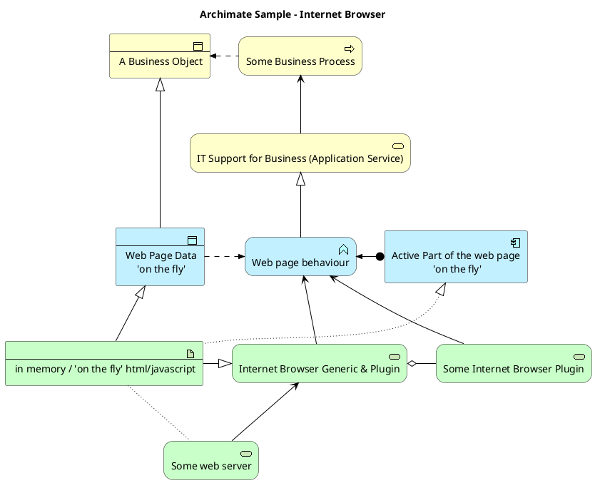
</details>

This example renders the following image:


For more information: https://github.com/plantuml-stdlib/Archimate-PlantUML

## Amazon Web Services

### AWS Icons

PlantUML images, sprites, macros, and other includes for Amazon Web Services (AWS) services and resources. Used to create PlantUML diagrams with AWS components. All elements are generated from the official [AWS Architecture Icons](https://aws.amazon.com/architecture/icons/) and when combined with [PlantUML](http://plantuml.com/) and the [C4 model](https://c4model.com/), are a great way to communicate your design, deployment, and topology as code.

Besides usage as custom sprites on PlantUML components, different types of diagrams can quickly and easily be created with the icons.

More info on [awslabs github account](https://github.com/awslabs/aws-icons-for-plantuml).

### AWS library [aws]

The AWS library consists of Amazon AWS icons, it provides icons of two different sizes.

Use it by including the file that contains the sprite, eg: `!include <aws/Storage/AmazonS3/AmazonS3>`.
When imported, you can use the sprite as normally you would, using `<$sprite_name>`.

You may also include the `common.puml` file, eg: `!include <aws/common>`, which contains helper macros defined.
With the `common.puml` imported, you can use the `NAME_OF_SPRITE(parameters...)` macro.

Example of usage:
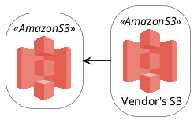

This example renders the following image:


### Amazon Labs AWS Library [awslib]

_Todo: TBC..._

## Azure library [azure]

The Azure library consists of Microsoft Azure icons.

Use it by including the file that contains the sprite, eg: `!include <azure/Analytics/AzureEventHub.puml>`.
When imported, you can use the sprite as normally you would, using `<$sprite_name>`.

You may also include the `AzureCommon.puml` file, eg: `!include <azure/AzureCommon.puml>`, which contains helper macros defined.
With the `azure/AzureCommon.puml` imported, you can use the `NAME_OF_SPRITE(parameters...)` macro.

Example of usage:
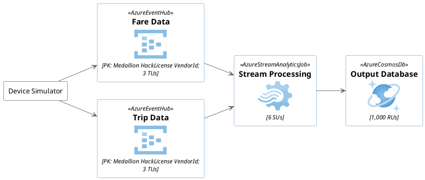

This example renders the following image:


## Bootstrap Icons [bootstrap]

This library consists of a free Bootstrap Icons style icons from Bootstrap. See the entire collection or search via a filter on the [Bootstrap Icons website](https://icons.getbootstrap.com/#search).

Use it by including the file that contains all the sprites: `!include <bootstrap/bootstrap>`.
When imported, you can use the sprite as normally you would, using `<$bi-sprite-name>`.
Notice that this library requires an `bi-` preffix on sprites names, this is to avoid clash of names if multiple sprites have the same name on different libraries. `bi` stands for Bootstrap Icon and this name is also used in the Bootstrap framework.

Example of usage:
```plantuml
@startuml
skinparam UsecaseBackgroundColor white
!include <bootstrap/bootstrap>

usecase a as "<$bi-globe>\nbi-globe"
usecase b as "<$bi-globe,scale=2.5>"
usecase c as "<$bi-globe{scale=2.5}>" #line:red

usecase d as "<$bi-bootstrap-fill>"
usecase e as "<$bi-bootstrap-fill{scale=2.5,color=blue}>"
usecase f as "<$bi-bootstrap-fill,scale=2.5,color=#00f>"
@enduml
```

This example renders the following image:

[](https://editor.plantuml.com/uml/TP3B2i8m44NtXVn3h2vR5S6Ds53q6zovcIHJ3HsJaWSkn7zN4TjIS7SNvyoTcJf4y37TY6MXDRO33pT-2gWWu05KU_4kMNrqv3o_Nqr4bisCLPGqyhrqBeReeLlrIR2CPUdhS-0GUBvVI5DUo4aKP_kB-K392LK41OJLPhaL8qfDg4TFFKNEvsGixZpgSRqUb7w_iZ54uxdu3neA2lKvlvAKy3bMctzgCLNdwtNpCMkq-lth5m00)

## C4 library (C4-PlantUML) [C4]

<!-- start C4 section -->

-black)
[![version: 2.12.1][Version Badge]][Version Link]


[![all properties see: ./stdlib/C4/README.md][See Badge]][See Link]

[Version Badge]: https://img.shields.io/badge/version-2.12.1-blue
[Version Link]: https://github.com/plantuml-stdlib/C4-PlantUML/tree/release/v2.12.0
[See Badge]: https://img.shields.io/badge/all_stdlib_specific_properties_see-./stdlib/C4/README.md-blue
[See Link]: ./stdlib/C4/README.md

> [!INFORMATION]
> **C4 library is patched to version 2.12.1:** This version contains the [Fix for "Use !option handwritten true" warning](https://github.com/plantuml-stdlib/C4-PlantUML/pull/397) too.
<!-- end C4 section -->

The C4 library enables a simple way of describing and communicate software architectures with an intuitive language.

It is the PlantUML integrated version of [C4-PlantUML](https://github.com/plantuml-stdlib/C4-PlantUML) and has the big advantage that it can be used without additional external includes.
(E.g. container diagrams can be drawn with `!include <C4/C4_Container>` and no `!include https://raw.githubusercontent.com/plantuml-stdlib/C4-PlantUML/master/C4_Container.puml` is required.)

Example of usage:

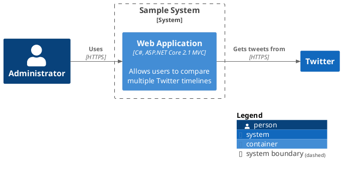

This example renders the following image:

[](https://www.plantuml.com/plantuml/uml/JL1TQy9047o_Nx5DNn8GYyN7KanJgmMhOivAdyAPRE7WFiBT1f7I_zvDjTfxMUvcPcTk9f5KeCuQSQDTRRe6uQ4OtnNZgl2Eb7OO7iKY_rXjPRMOliXgypgRopGJOeqXUfUgncetW2JlfuuK5FcGPA8yHa9RFVdEDIeSqth4f5BPrY2Si2I3Bm5yBaxf0VULQbjcxd0FUTiQNIlItYNyLDmE82_Nm-LKiYGWt0z7yFPUz5XkZ3z4w2A62EIXzhPLJB6T8TrRoeCcmW2aBHhsYXpn-nmofHF8Uyuq1iK6pT_dhh6saPKyvrAkooJx9LtGwvePKkGhzkCpUFjV8ihvQiTTpgRBP-vnWgxX-dy0)

## Classy library [classy]

The Classy library allows for using an Object Oriented approach to diagramming
in PlantUML.

That is to say that it allows you to define and instantiate your own classes as
well as allow you to call methods defined on those classes. You can also inherit
from one or more classes where desired.

Use it by including the file that contains the Classy class that you want to use
within your diagram. Alternatively, if you want to define your own type, you can
just include the `core.puml` file, eg: `!include <classy/core>`, which contains
all of the necessary functions.

Example of usage:
```plantuml
@startuml

    !include <classy/core>

    $class(HelloWorld)
        $classVar(msg, string, "Hello World!")

        $classMethod(getMessage)
            !function HelloWorld__getMessage($this)
                !return $getInstanceVar($this, 'msg')
            !endfunction
        $endclassMethod(getMessage)

        $classMethod(setMessage)
            !function HelloWorld__setMessage($this, $args)
                $setInstanceVar($this, 'msg', $call($args, 'each'))
                !return $this
            !endfunction
        $endclassMethod(setMessage)
        $endclass(HelloWorld)

        !$hello = $new(HelloWorld)
        Alice -> Bob : $call($hello, 'getMessage')

        $call($hello, 'setMessage', array($new(array), '2nd message!'), $void=%true())
        Alice -> Bob : $call($hello, 'getMessage')

@enduml
```

This example renders the following image:


## Classy C4 library [classy-c4]

The Classy C4 library combines the Classy and C4 libraries by defining Classy
classes that wrap the C4 macros.

Example of usage:
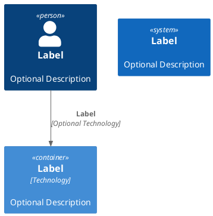

This example renders the following image:


## Domain Story library (DomainStory-PlantUML) [DomainStory]

This library provides a set of macros to easily describe and document a domain story which was developed in
a [Domain Storytelling](http://www.domainstorytelling.org) workshop.

For more usage instructions see [DomainStory-PlantUML](https://github.com/johthor/DomainStory-PlantUML).

Example of usage:

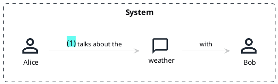

This example renders the following image:


## Edgy Enterprise Design [edgy]
Edgy is an Open Source tool for collaborative Enterprise Design. The library is an adaption of the EDGY Tools for PlantUML usage.

The Sprites are based on the [Enterprise Design with EDGY](https://www.enterprise.design/). They'll be rendered as SVG sprites, so you need a quite actual PlantUML distribution.

Use it by including the file that contains the sprite, eg: `!include <edgy/edgy>`.
There are two visual sets:
* `!include <edgy/edgy>` is the visualization according to the open source set of edgy.
* `!include <edgy/edgy2>` is the one which describes with stereotypes what kind of element it is. If you have color blinded people, this one could be the better one.
All procedures are compatible between both sets. So you can begin with one and switch to the other just to have a look which of the one fits visually the best.

The library is not complete yet, but it's a good start.

In general, the procedures for elements and facets do have the form of
```plantuml
$elementorfacet("label", alias, lighterColor)
```
* ```"label"``` is the name of the element or facet. It is mandatory.
* ```alias``` is used for linking elements and facets. It is optional.
* ```lighterColor``` is used as a boolean value (!) to use a lighter color for the element or facet. It is optional.
  * Facets are drawn with lighter colors than Elements as default.
  * ```0``` is false. Any other value is true.  Or use ```%true()``` and ```%false()``` (see [Boolean expression in Preprocessing](https://plantuml.com/de/preprocessing#55eb000153a81c72)).

### Facets
Facets do have the edgy facet name followed with ```Facet``` as tail, to distinguish them from elements.
The following facets are implemented: ```$baseFacet```,```$identityFacet```,```$brandFacet```,```$experienceFacet```,```$productFacet```,```$architectureFacet```,```$organisationFacet```

### Elements
Elements do have the edgy element name.
The following elements are implemented:
Base: ```$people```,```$outcome```,```$activity```,```$object```
Identity: ```$purpose```,```$story```,```$content```
Brand: ```$brand```
Experience: ```$task```,```$channel```,```$journey```
Product: ```$product```
Architecture: ```$capability```,```$asset```,```$process```
Organisation: ```$organisation```

Elements can be nested into facets:
```plantuml
$architectureFacet("Architecture") {
  $capability("Capability")
}
```

However, it is also possible to nest elements if needed:
```plantuml
$capability("Customer Interaction") {
    $capability("Passenger Services", pass, 1) {
        $capability("Passenger Information", info)
    }
}
```

### Links
Links do have the form of
```plantuml
$link(fromAlias, toAlias, "label")
```
* ```fromAlias``` is the starting element or facet. It is mandatory.
* ```toAlias``` is the target element or facet. It is mandatory.
* ```"label""``` is a label written on the connection. This is optional.

There are only three sort of links:
* ```$link``` is a unidirectional link between elements or facets.
* ```$flow``` is a directed flow between elements or facets.
* ```$tree``` is a hierarchical representation of elements as a tree relationship.

Generally, all links do have the possibility to give the rendere a hint in which direction the link should be drawn. This is done by adding ```Up```, ```Down```, ```Left```, ```Right``` as a tail to the link name (e.g. ```$linkUp```, ```$linkDown```, ```$linkLeft```, ```$linkRight```).

### Concrete example of usage:
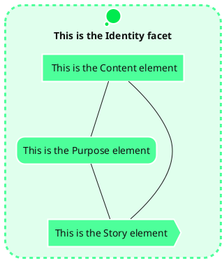

## EIP-PlantUML [eip]

EIP-PlantUML provides [Enterprise Integrations Patterns](https://www.enterpriseintegrationpatterns.com/) elements to [PlantUML](http://plantuml.com/) to provide easy support of designing EIP architectures for both, up-front design as well as development-time automated documentation generation.
Example of usage:
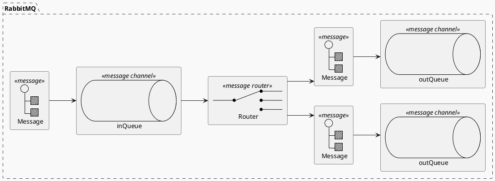
This example renders the following image:


## Elastic library [elastic]

The Elastic library consists of [Elastic](https://www.elastic.co) icons.
It is similar in use to the AWS and Azure libraries (it used the same tool to create them).

Use it by including the file that contains the sprite, eg: `!include <elastic/elasticsearch/elasticsearch.puml>`.
When imported, you can use the sprite as normally you would, using `<$sprite_name>`.

You may also include the `common.puml` file, eg: `!include <elastic/common>`, which contains helper macros defined.
With the `common.puml` imported, you can use the `NAME_OF_SPRITE(parameters...)` macro.

Example of usage:
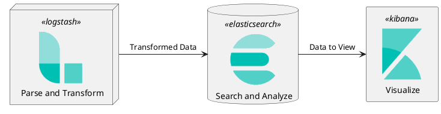

This example renders the following image:


## Google Cloud Platform [gcp]

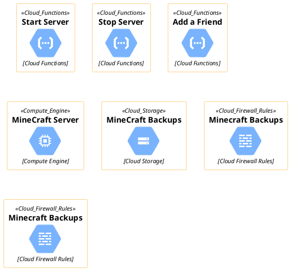
This example renders the following image:


## K8S [k8s]

These are the PlantUML sprites, macros and stereotypes for creating PlantUML diagrams with the Kubernetes components. The official Kubernetes Icons Set (where this work is based) can be found here
This repo is heavily influenced by the awesome work from Ricardo Niepel on Azure-PlantUML
Example of usage:
```plantuml
@startuml
    !include <k8s/Common>
    !include <k8s/Simplified>
    !include <k8s/OSS/all>
    footer Kubernetes Plant-UML
    scale max 1024 width
    skinparam {
        nodesep 10
        ranksep 10
    }
    actor "User" as userAlias
    left to right direction
    Cluster_Boundary(cluster, "Kubernetes Cluster") {
        Namespace_Boundary(ns, "Web") {
            KubernetesSvc(svc, "service", "")
            KubernetesPod(pod1, "web-pod1", "")
            KubernetesPod(pod2, "web-pod2", "")
        }
    }
    Rel(userAlias,svc,"get HTTP/1.1 index.html", "1")
    Rel(svc,pod1,"load Balances to Pods", "2")
    Rel(svc,pod2,"load Balances to Pods", "2")
    Rel_U(pod1, svc, "serves content", "3")
    Rel(svc, userAlias, "return content to", "4")
@enduml
```
This example renders the following image:


## Google Material Icons [material]

### Old sprites
This library consists of a free Material style icons from Google and other artists.

Use it by including the file that contains the sprite, eg: `!include <material2.1.19/folder_move>`.
When imported, you can use the sprite as normally you would, using `<$ma_sprite_name>`.
Notice that this library requires an `ma_` preffix on sprites names, this is to avoid clash of names if multiple sprites have the same name on different libraries.

You may also include the `common.puml` file, eg: `!include <material2.1.19/common>`, which contains helper macros defined.
With the `common.puml` imported, you can use the `MA_NAME_OF_SPRITE(parameters...)` macro, note again the use of the prefix `MA_`.

Example of usage:
```plantuml
@startuml
!include <material2.1.19/common>
' To import the sprite file you DON'T need to place a prefix!
!include <material2.1.19/folder_move>

MA_FOLDER_MOVE(Red, 1, dir, rectangle, "A label")
@enduml
```

This example renders the following image:


#### Notes

When mixing sprites macros with other elements you may get a syntax error if, for example, trying to add a rectangle along with classes.
In those cases, add `{` and `}` after the macro to create the empty rectangle.

Example of usage:
```plantuml
@startuml
!include <material2.1.19/common>
' To import the sprite file you DON'T need to place a prefix!
!include <material2.1.19/folder_move>

MA_FOLDER_MOVE(Red, 1, dir, rectangle, "A label") {
}

class foo {
  bar
}
@enduml
```

This example renders the following image:


### New SVG sprites

This library consists of a (SVG) Material Design Icons style icons from Google and other artists. See the entire collection or search via a filter on the [Material Design Icons website](https://pictogrammers.com/library/mdi/).

Use it by including the file that contains all the sprites: `!include <material/material>`.
When imported, you can use the sprite as normally you would, using `<$mdi-sprite-name>`.
Notice that this library requires an `mdi-` preffix on sprites names, this is to avoid clash of names if multiple sprites have the same name on different libraries. `mdi` stands for Material Design Icon.

Example of usage:
```plantuml
@startuml
!include <material/material>

usecase a as "<$mdi-web>"
usecase b as "<$mdi-web,scale=2>"
usecase c as "<$mdi-web{scale=2}>" #line:red

usecase d as "<$mdi-material-design>"
usecase e as "<$mdi-material-design{scale=2,color=blue}>"
usecase f as "<$mdi-material-design,scale=2,color=#00f>"
@enduml
```

This example renders the following image:

[](https://editor.plantuml.com/uml/TP312eCm38Rl1T-XqnsLoOv3YwyIspWAQOMcnSFmtRV1okh1M-3_llmX4qS8CJcgnCLwJScW71n431RebWTLYKeaHWsC4YImh8UhCxRRS5RrFvgFKSiQ2CTxYUWZyleXkwfbGzRZ8w0fsqp1vtCwWsoVlboBvrYkQFLAQnXdIhYNwdAkjaUrwVlbQqxepUTbRm00)


## Tupadr3 library [tupadr3]

This library contains several libraries of icons (including Devicons and Font Awesome )

Use it by including the file that contains the sprite, eg: `!include <tupadr3/font-awesome/align_center>`.
When imported, you can use the sprite as normally you would, using `<$sprite_name>`.

You may also include the `common.puml` file, eg: `!include <tupadr3/common>`, which contains helper macros defined.
With the `common.puml` imported, you can use the `NAME_OF_SPRITE(parameters...)` macro.

Example of usage:
```plantuml
@startuml
    !include <tupadr3/common>
    !include <tupadr3/font-awesome/server>
    !include <tupadr3/font-awesome/database>

    title Styling example

    FA_SERVER(web1,web1) #Green
    FA_SERVER(web2,web2) #Yellow
    FA_SERVER(web3,web3) #Blue
    FA_SERVER(web4,web4) #YellowGreen
    FA_DATABASE(db1,LIVE,database,white) #RoyalBlue
    FA_DATABASE(db2,SPARE,database) #Red

    db1 <--> db2
    web1 <--> db1
    web2 <--> db1
    web3 <--> db1
    web4 <--> db1
@enduml
```

This example renders the following image:


## Sources

* **aws**: made by https://github.com/milo-minderbinder/AWS-PlantUML
* **classy**: made by https://github.com/james-gadrow-kr/classy-plantuml
* **classy-c4**: made by https://github.com/james-gadrow-kr/classy-c4
* **tupadr3**: made by https://github.com/tupadr3/plantuml-icon-font-sprites
* **Material Icons**: from https://github.com/Templarian/MaterialDesign
* **Bootstrap Icons**: from https://github.com/twbs/icons
* **Elastic Icons**: from https://github.com/Crashedmind/PlantUML-Elastic-icons
* **Domain Story**: from https://github.com/johthor/DomainStory-PlantUML

You can create Pull Request to update or add some library here if you find it relevant.
