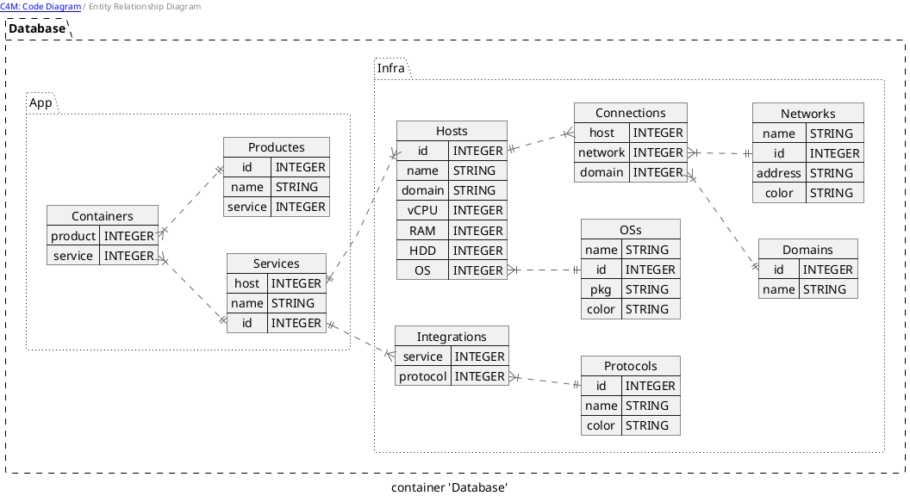

```plantuml
@startuml
!include <C4/C4_Component>
!procedure $rel($left, $right,$direction='D')
    $left ||.$direction.|{ $right
!endprocedure
left header [[https://c4model.com C4M: Code Diagram]] / Entity Relationship Diagram
left to right direction
caption container 'Database'
skinparam linetype polyline

folder "Database" #line.dashed {
    package App <<domain>> #line.dotted {
        map Productes {
            id      => INTEGER
            name    => STRING
            service => INTEGER
        }
        map Containers {
            product => INTEGER
            service => INTEGER
        }
        map Services {
            host => INTEGER
            name => STRING
            id   => INTEGER
        }
        $rel('Productes::id', 'Containers::product' , 'U')
        $rel('Services::id', 'Containers::service', 'U')
    }

    package Infra <<domain>> #line.dotted {
        map Networks {
            name    => STRING
            id      => INTEGER
            address => STRING
            color   => STRING
        }
        map OSs {
            name  => STRING
            id    => INTEGER
            pkg   => STRING
            color => STRING
        }
        map Hosts {
            id     => INTEGER
            name   => STRING
            domain => STRING
            vCPU   => INTEGER
            RAM    => INTEGER
            HDD    => INTEGER
            OS     => INTEGER
        }
        map Domains {
            id   => INTEGER
            name => STRING
        }
        map Connections {
            host    => INTEGER
            network => INTEGER
            domain => INTEGER
        }
        map Protocols {
            id    => INTEGER
            name  => STRING
            color => STRING
        }
        map Integrations {
            service  => INTEGER
            protocol => INTEGER
        }
        $rel('Services::host', 'Hosts::id')
        $rel('Networks::id', 'Connections::network', 'U')
        $rel('Domains::id', 'Connections::domain', 'U')
        $rel('Hosts::id', 'Connections::host')
        $rel('OSs::id', 'Hosts::OS', 'U')
        $rel('Services::id', 'Integrations::service')
        $rel('Protocols::id', 'Integrations::protocol', 'U')
    }
}
@enduml
```
