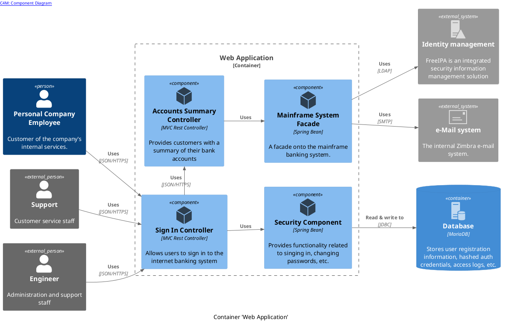

```plantuml
@startuml
!include <office/Servers/database_server>
!include <office/Servers/domain_controller>
!include <office/Concepts/node_generic>
!include <office/Concepts/email>
!include <C4/C4_Component>

left to right direction
left header [[https://c4model.com C4M: Component Diagram]]

caption Container 'Web Application'

Person(client, "Personal Company Employee", "Customer of the company's internal services.")
Person_Ext(support, "Support", "Customer service staff")
Person_Ext(engineer, "Engineer", "Administration and support staff")
ContainerDb(db, 'Database',  'MariaDB',   'Stores user registration information, hashed auth credentials, access logs, etc.', $sprite='database_server')
System_Ext(email, 'e-Mail system', 'The internal Zimbra e-mail system.', $sprite='email')
System_Ext(ipa, "Identity management", "FreeIPA is an integrated security information management solution", $sprite="domain_controller")

Container_Boundary(api, 'Web Application') {
    Component(sign, "Sign In Controller", "MVC Rest Controller", "Allows users to sign in to the internet banking system", $sprite="node_generic")
    Component(accounts, "Accounts Summary Controller", "MVC Rest Controller", "Provides customers with a summary of their bank accounts", $sprite="node_generic")
    Component(security, "Security Component", "Spring Bean", "Provides functionality related to singing in, changing passwords, etc.", $sprite="node_generic")
    Component(mbsfacade, "Mainframe System Facade", "Spring Bean", "A facade onto the mainframe banking system.", $sprite="node_generic")

    Rel(sign, security, "Uses")
    Rel(accounts, mbsfacade, "Uses")
    Rel(security, db, "Read & write to", "JDBC")
    Rel(mbsfacade, ipa, "Uses", "LDAP")
    Rel(mbsfacade, email, "Uses", "SMTP")
}

Rel(client, sign, "Uses", "JSON/HTTPS")
Rel(support, sign, "Uses", "JSON/HTTPS")
Rel(engineer, sign, "Uses", "JSON/HTTPS")
Rel_L(sign, accounts, "Uses", "JSON/HTTPS")
engineer -[hidden]- accounts
support -[hidden]- accounts
client -[hidden]- accounts
@enduml
```
