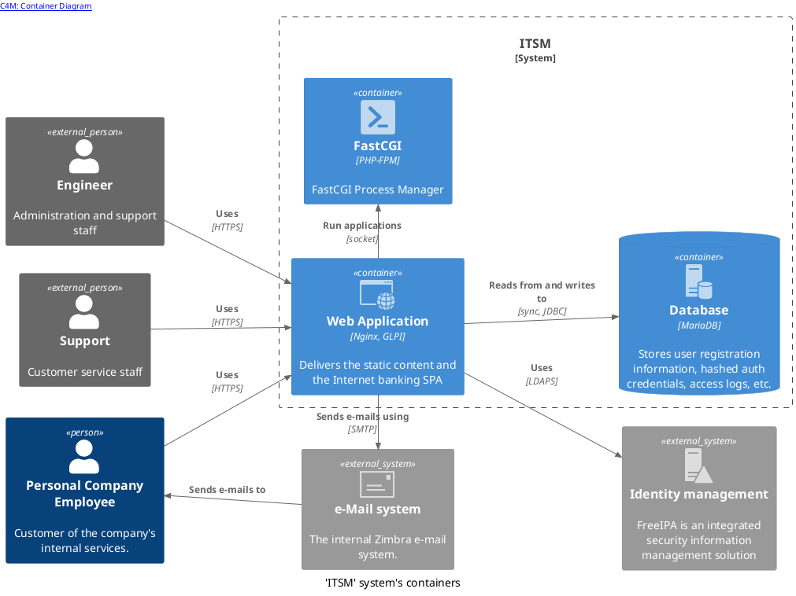

```plantuml
@startuml
!include <office/Servers/database_server>
!include <office/Servers/domain_controller>
!include <office/Concepts/windows_powershell>
!include <office/Concepts/application_web>
!include <office/Concepts/node_generic>
!include <office/Concepts/email>
!include <C4/C4_Container>

left to right direction
left header [[https://c4model.com C4M: Container Diagram]]
caption 'ITSM' system's containers

Person(client, "Personal Company Employee", "Customer of the company's internal services.")
Person_Ext(support, "Support", "Customer service staff")
Person_Ext(engineer, "Engineer", "Administration and support staff")
System_Ext(email, "e-Mail system", "The internal Zimbra e-mail system.", $sprite="email")
System_Ext(ipa, "Identity management", "FreeIPA is an integrated security information management solution", $sprite="domain_controller")

System_Boundary(itsm, "ITSM") {
    Container(web, "Web Application", "Nginx, GLPI", "Delivers the static content and the Internet banking SPA", $sprite='application_web')
    Container(pl, "FastCGI", "PHP-FPM", "FastCGI Process Manager", $sprite='windows_powershell')
    ContainerDb(db, "Database", "MariaDB", "Stores user registration information, hashed auth credentials, access logs, etc.", $sprite='database_server')
}

Rel(client, web, "Uses", "HTTPS")
Rel(support, web, "Uses", "HTTPS")
Rel(engineer, web, "Uses", "HTTPS")
Rel(web, db, "Reads from and writes to", "sync, JDBC")
Rel_L(web, email, "Sends e-mails using", "SMTP")
Rel_R(web, pl, "Run applications", "socket")
Rel(web, ipa, "Uses", "LDAPS")
Rel_U(email, client, "Sends e-mails to")
email -[hidden]- ipa

@enduml
```
