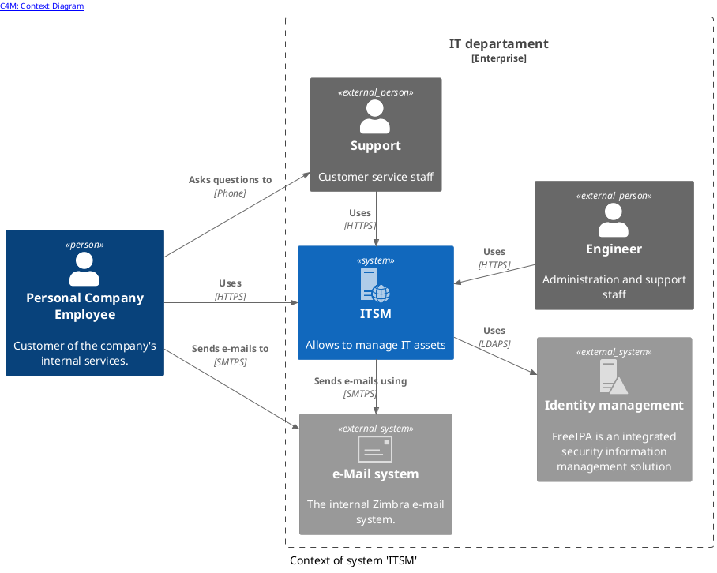

```plantuml
@startuml
!include <office/Servers/domain_controller>
!include <office/Servers/web_server>
!include <office/Concepts/application_web>
!include <office/Concepts/email>
!include <C4/C4_Context>

skinparam linetype polyline
left header [[https://c4model.com C4M: Context Diagram]]
left to right direction
caption Context of system 'ITSM'

Person(client, "Personal Company Employee", "Customer of the company's internal services.")
Enterprise_Boundary(itd, "IT departament") {
    together {
        System_Ext(email, "e-Mail system", "The internal Zimbra e-mail system.", $sprite="email")
        Person_Ext(support, "Support", "Customer service staff")
        System(itsm, "ITSM", "Allows to manage IT assets", $sprite="web_server")
    }
    together {
        Person_Ext(engineer, "Engineer", "Administration and support staff")
        System_Ext(ipa, "Identity management", "FreeIPA is an integrated security information management solution", $sprite='domain_controller')
    }
}
Rel(client, itsm, "Uses", "HTTPS")
Rel(client, email, "Sends e-mails to", "SMTPS")
Rel_U(client, support, "Asks questions to", "Phone")
Rel_L(support, itsm, "Uses", "HTTPS")
Rel_L(itsm, email, "Sends e-mails using", "SMTPS")
Rel(engineer, itsm, "Uses", "HTTPS")
Rel(itsm, ipa, "Uses", "LDAPS")
@enduml
```
