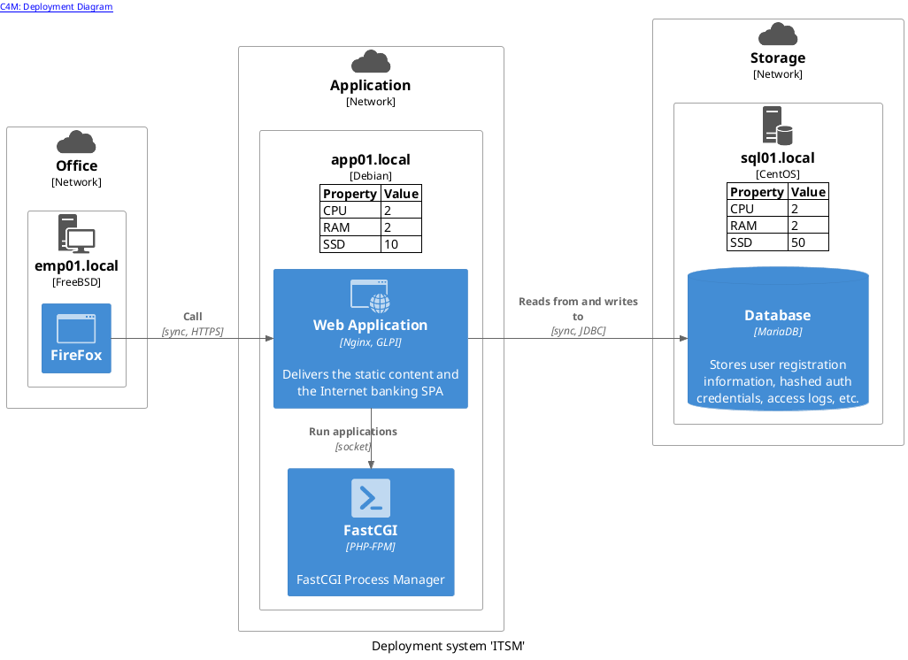

```plantuml
@startuml
!include <office/Servers/database_server>
!include <office/Servers/domain_controller>
!include <office/Concepts/windows_powershell>
!include <office/Concepts/application_web>
!include <office/Concepts/application_generic>
!include <office/Concepts/email>
!include <office/Clouds/private_cloud>
!include <office/Devices/workstation>
!include <C4/C4_Deployment>

skinparam linetype polyline
hide stereotype
left to right direction

left header [[https://c4model.com C4M: Deployment Diagram]]

caption Deployment system 'ITSM'

Deployment_Node(cld0, 'Office', 'Network', $sprite='private_cloud') {
    Deployment_Node(emp, 'emp01.local', 'FreeBSD', $sprite='workstation') {
        Container(ff, "FireFox", $sprite='application_generic')
    }
}
Deployment_Node(cld1, 'Application', 'Network', $sprite='private_cloud') {
    AddProperty("CPU", "2")
    AddProperty("RAM", "2")
    AddProperty("SSD", "10")
    Deployment_Node(app, "app01.local", "Debian", $sprite="web_server") {
        Container(web, "Web Application", "Nginx, GLPI", "Delivers the static content and the Internet banking SPA", $sprite='application_web')
        Container(pl, "FastCGI", "PHP-FPM", "FastCGI Process Manager", $sprite='windows_powershell')
    }
}
Deployment_Node(cld2, 'Storage', 'Network', $sprite='private_cloud') {
    AddProperty("CPU", "2")
    AddProperty("RAM", "2")
    AddProperty("SSD", "50")
    Deployment_Node(sql, "sql01.local", "CentOS", $sprite="database_server") {
        ContainerDb(db, "Database", "MariaDB", "Stores user registration information, hashed auth credentials, access logs, etc.", $sprite='database')
    }
}

Rel(ff, web, "Call", "sync, HTTPS")
Rel(web, db, "Reads from and writes to", "sync, JDBC")
Rel_L(web, pl, "Run applications", "socket")

@enduml
```
