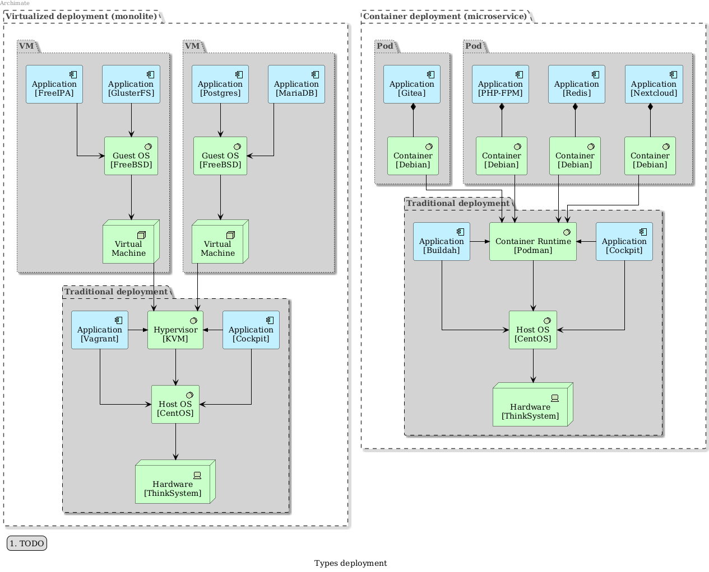

```plantuml
@startuml
!include <archimate/Archimate>
skinparam defaultFontName Dejavu Serif

!procedure $rel($left, $right)
    !foreach $l in %splitstr($left, "~")
        !foreach $r in %splitstr($right, "~")
            Rel_Serving($l, $r)
        !endfor
    !endfor
!endprocedure
!$HW='Hardware\n[ThinkSystem]'
!$HOS='Host OS\n[CentOS]'
!$GOS='Guest OS\n[FreeBSD]'
!$APP='Application'
!$IMG='Container\n[Debian]'
!$VM='Virtual\nMachine'

skinparam linetype ortho
left header Archimate
caption Types deployment
Grouping(grp02, "Virtualized deployment (monolite)") {
    Group(grp22, "Traditional deployment") #line.dashed {
        Technology_Device(HW20, $HW)
        Technology_SystemSoftware(OS20, $HOS)
        Technology_SystemSoftware(HP20, "Hypervisor\n[KVM]")
        Application_Component(APP25, 'Application\n[Vagrant]')
        Application_Component(APP26, 'Application\n[Cockpit]')
        $rel('HP20~APP25~APP26', OS20)
        Rel_Serving(OS20, HW20)
        Rel_Triggering_Right(APP25, HP20)
        Rel_Triggering_Left(APP26, HP20)
    }
    Group(grp20, "VM") #line.dotted {
        Technology_Node(VM21, $VM)
        Technology_SystemSoftware(OS21, $GOS)
        Application_Component(APP21, 'Application\n[MariaDB]')
        Application_Component(APP22, 'Application\n[Postgres]')
        $rel('APP21~APP22', OS21)
        Rel_Serving(OS21, VM21)
    }
    Group(grp21, "VM") #line.dotted {
        Technology_Node(VM22, $VM)
        Technology_SystemSoftware(OS22, $GOS)
        Application_Component(APP23, 'Application\n[GlusterFS]')
        Application_Component(APP24, 'Application\n[FreeIPA]')
        $rel('APP23~APP24', OS22)
        Rel_Serving(OS22, VM22)
    }
    $rel('VM21~VM22', HP20)
}

Grouping(grp03, "Container deployment (microservice)") {
    Group(grp30, "Pod") #line.dotted {
        Application_Component(APP31, 'Application\n[Nextcloud]')
        Application_Component(APP32, 'Application\n[Redis]')
        Application_Component(APP33, 'Application\n[PHP-FPM]')
        Technology_SystemSoftware(C31, $IMG)
        Technology_SystemSoftware(C32, $IMG)
        Technology_SystemSoftware(C33, $IMG)
        Rel_Composition(APP31, C31)
        Rel_Composition(APP32, C32)
        Rel_Composition(APP33, C33)
    }
    Group(grp31, "Pod") #line.dotted {
        Application_Component(APP34, 'Application\n[Gitea]')
        Technology_SystemSoftware(C34, $IMG)
        Rel_Composition(APP34, C34)
    }
    Group(grp32, "Traditional deployment") #line.dashed {
        Technology_Device(HW30, $HW)
        Technology_SystemSoftware(OS30, $HOS)
        Technology_SystemSoftware(CR30, "Container Runtime\n[Podman]")
        Application_Component(APP36, 'Application\n[Buildah]')
        Application_Component(APP35, 'Application\n[Cockpit]')
        $rel('APP36~APP35', OS30)
        Rel_Serving(CR30, OS30)
        Rel_Serving(OS30, HW30)
        $rel('C31~C32~C33~C34', CR30)
        Rel_Triggering_Right(APP36, CR30)
        Rel_Triggering_Left(APP35, CR30)
    }
}
legend left
    # TODO
endlegend
@enduml
```
