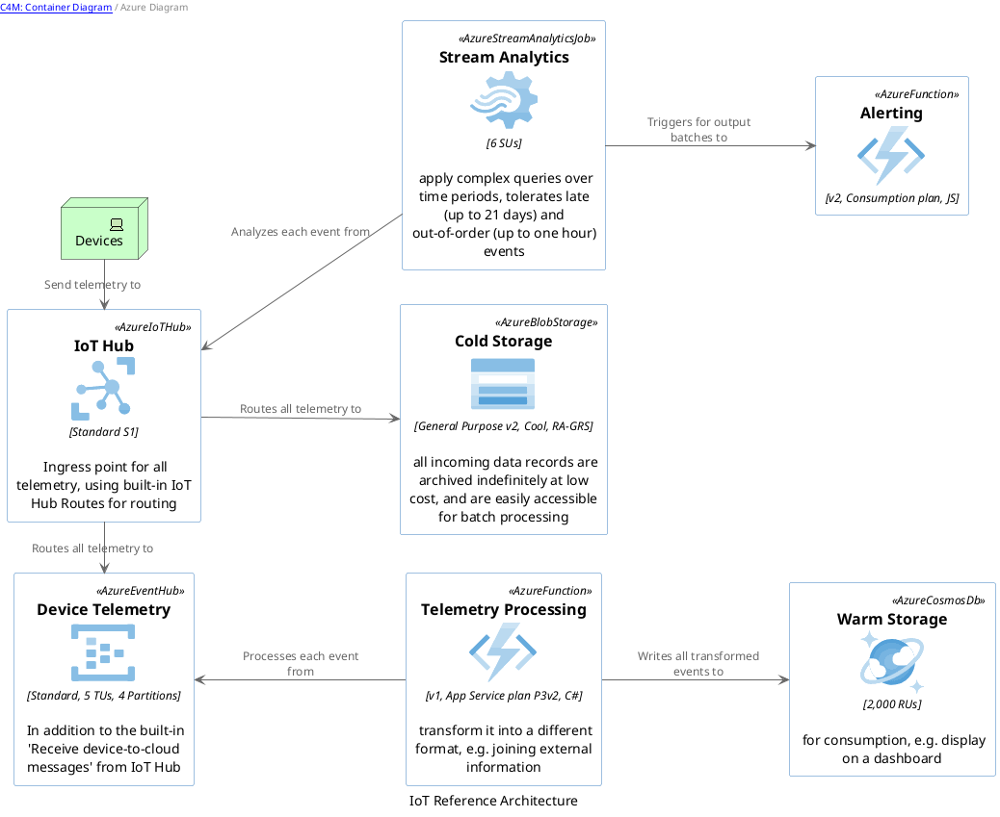

```plantuml
@startuml
!include <archimate/Archimate>
!include <azure/AzureCommon>
!include <azure/AzureC4Integration>
!foreach $item in %splitstr('Networking~DevOps~Security~Databases~Storage~Web~Management~InternetOfThings~Analytics~Compute~Identity~Integration', '~')
    !include <azure/$item/all.puml>
!endfor
skinparam linetype polyline

left to right direction
left header [[https://c4model.com C4M: Container Diagram]] / Azure Diagram
caption IoT Reference Architecture

Technology_Device(devices, "Devices")
AzureBlobStorage(coldBlobStorage, "Cold Storage", "General Purpose v2, Cool, RA-GRS", "all incoming data records are archived indefinitely at low cost, and are easily accessible for batch processing")
AzureIoTHub(iotHub, "IoT Hub", "Standard S1", "Ingress point for all telemetry, using built-in IoT Hub Routes for routing")
AzureEventHub(eventHubTelemetry, "Device Telemetry", "Standard, 5 TUs, 4 Partitions", "In addition to the built-in 'Receive device-to-cloud messages' from IoT Hub")
AzureFunction(telemetryFunction, "Telemetry Processing", "v1, App Service plan P3v2, C#", "transform it into a different format, e.g. joining external information")
AzureCosmosDb(warmStorageCosmos, "Warm Storage", "2,000 RUs", "for consumption, e.g. display on a dashboard")
AzureStreamAnalyticsJob(streamAnalytics, "Stream Analytics", "6 SUs", "apply complex queries over time periods, tolerates late (up to 21 days) and out-of-order (up to one hour) events")
AzureFunction(alertingFunction, "Alerting", "v2, Consumption plan, JS")

Rel_Serving_Right(devices, iotHub, "Send telemetry to")
Rel_Serving(iotHub, coldBlobStorage, "Routes all telemetry to")
Rel_Serving_Right(iotHub, eventHubTelemetry, "Routes all telemetry to")
Rel_Serving_Up(streamAnalytics, iotHub, "Analyzes each event from")
Rel_Serving_Up(telemetryFunction, eventHubTelemetry, "Processes each event from")
Rel_Serving(streamAnalytics, alertingFunction, "Triggers for output batches to")

Rel_Serving(telemetryFunction, warmStorageCosmos, "Writes all transformed events to")

@enduml
```
