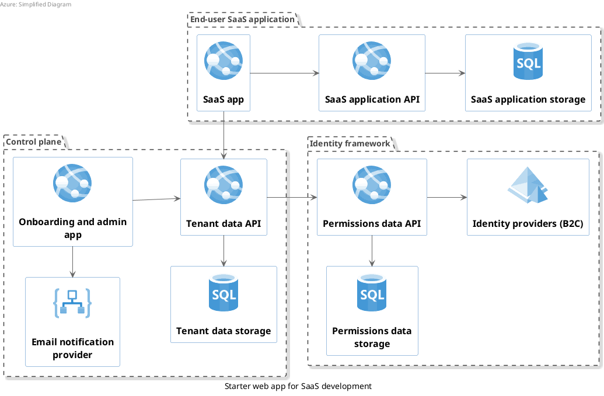

```plantuml
@startuml
!include <archimate/Archimate>
!include <azure/AzureCommon>
!include <azure/AzureC4Integration>
!foreach $item in %splitstr('Networking~DevOps~Security~Databases~Storage~Web~Management~InternetOfThings~Analytics~Compute~Identity~Integration', '~')
    !include <azure/$item/all.puml>
!endfor
!include <azure/AzureSimplified>
skinparam linetype polyline
left to right direction
left header Azure: Simplified Diagram
caption Starter web app for SaaS development

Grouping(cp, "Control plane") {
    AzureAppService(tapi, "Tenant data API", "")
    AzureSqlDatabase(tsql, "Tenant data storage", "")
    AzureLogicApps(mail, "Email notification provider", "")
    AzureAppService(on, "Onboarding and admin app", "")
    Rel_Serving_Left(on, mail, "")
    Rel_Serving(on, tapi, "")
    Rel_Serving_Left(tapi, tsql, "")
}
Grouping(if, "Identity framework") {
    AzureAppService(papi, "Permissions data API", "")
    AzureSqlDatabase(psql, "Permissions data storage", "")
    AzureActiveDirectoryDomainServices(idn, "Identity providers (B2C)", "")
    Rel_Serving(papi, idn)
    Rel_Serving_Left(papi, psql)
    Rel_Serving(tapi, papi)
}
Grouping(eu, "End-user SaaS application") {
    AzureAppService(sapi, "SaaS application API", "")
    AzureAppService(sapp, "SaaS app", "")
    AzureSqlDatabase(ssql, "SaaS application storage", "")
    Rel_Serving_Left(sapp, tapi)
    Rel_Serving(sapp, sapi)
    Rel_Serving(sapi, ssql)
}
@enduml
```
