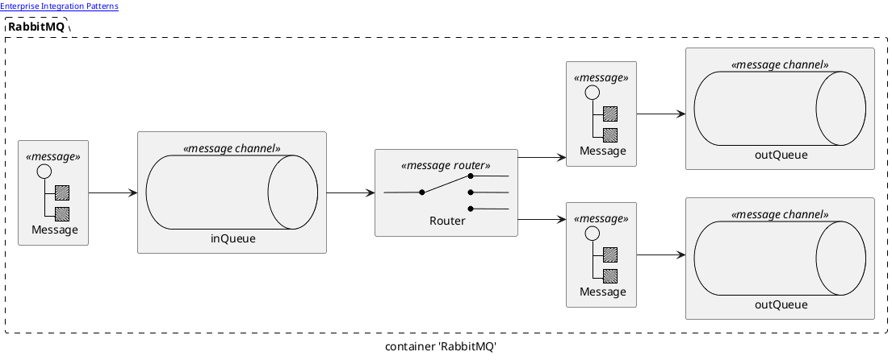

```plantuml
@startuml
!include <eip/EIP-PlantUML>
skinparam linetype ortho
caption container 'RabbitMQ'

left header [[https://www.enterpriseintegrationpatterns.com/ Enterprise Integration Patterns]]
left to right direction

package "RabbitMQ" #line.dashed {
    Message(msg0, Message)
    Message(msg1, Message)
    Message(msg2, Message)
    MsgChannel(ch0, inQueue)
    MsgChannel(ch1, outQueue)
    MsgChannel(ch2, outQueue)
    MessageRouter(rt0, Router)
}
Send(msg0, ch0)
Send(ch0, rt0)
Send(rt0, msg1)
Send(rt0, msg2)
Send(msg1, ch1)
Send(msg2, ch2)
@enduml
```
