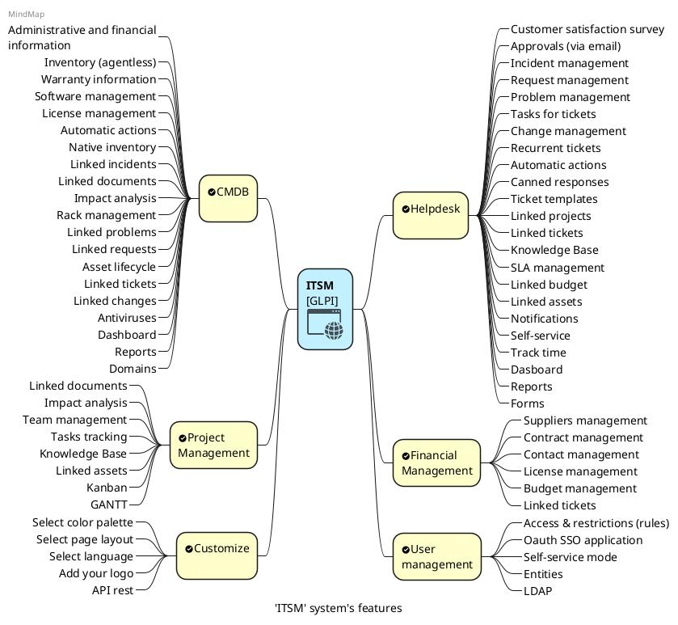

```plantuml
@startmindmap

!include <office/all>

left header MindMap
skinparam WrapWidth 200
caption 'ITSM' system's features

*[#Application] <b>ITSM\n[GLPI]\n<$application_web>

**[#Business] <&circle-check>Helpdesk\n
***_ Customer satisfaction survey
***_ Approvals (via email)
***_ Incident management
***_ Request management
***_ Problem management
***_ Tasks for tickets
***_ Change management
***_ Recurrent tickets
***_ Automatic actions
***_ Canned responses
***_ Ticket templates
***_ Linked projects
***_ Linked tickets
***_ Knowledge Base
***_ SLA management
***_ Linked budget
***_ Linked assets
***_ Notifications
***_ Self-service
***_ Track time
***_ Dasboard
***_ Reports
***_ Forms

**[#Business] <&circle-check>Financial\nManagement
***_ Suppliers management
***_ Contract management
***_ Contact management
***_ License management
***_ Budget management
***_ Linked tickets

**[#Business] <&circle-check>User\nmanagement
***_ Access & restrictions (rules)
***_ Oauth SSO application
***_ Self-service mode
***_ Entities
***_ LDAP

left side
**[#Business] <&circle-check>CMDB\n
***_ Administrative and financial information
***_ Inventory (agentless)
***_ Warranty information
***_ Software management
***_ License management
***_ Automatic actions
***_ Native inventory
***_ Linked incidents
***_ Linked documents
***_ Impact analysis
***_ Rack management
***_ Linked problems
***_ Linked requests
***_ Asset lifecycle
***_ Linked tickets
***_ Linked changes
***_ Antiviruses
***_ Dashboard
***_ Reports
***_ Domains

**[#Business] <&circle-check>Project\nManagement
***_ Linked documents
***_ Impact analysis
***_ Team management
***_ Tasks tracking
***_ Knowledge Base
***_ Linked assets
***_ Kanban
***_ GANTT

**[#Business] <&circle-check>Customize\n
***_ Select color palette
***_ Select page layout
***_ Select language
***_ Add your logo
***_ API rest

@endmindmap
```
