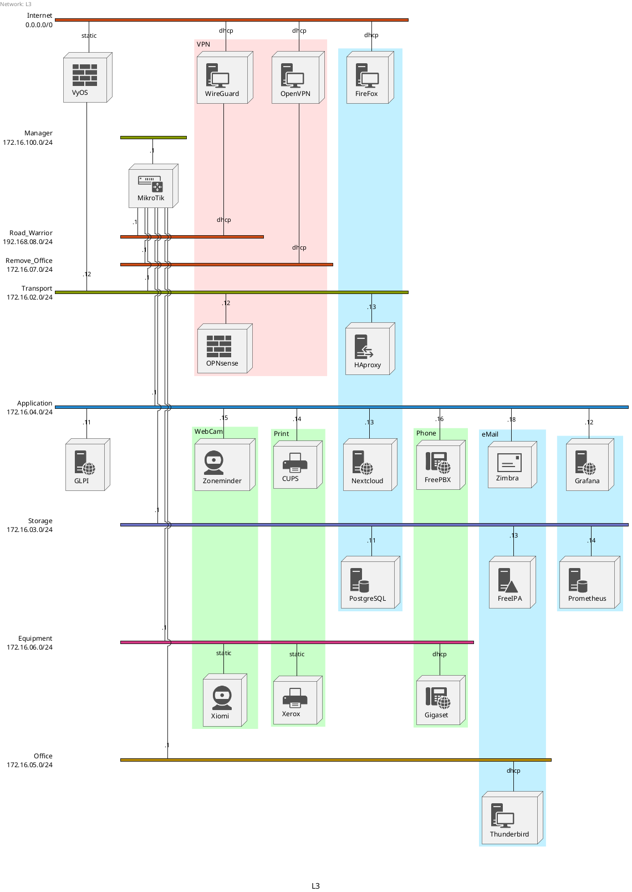

```plantuml
@startuml
!include <office/all>

!$networks = {
    "Manager"       : {
        "vlan"   : "100",
        "color"  : "#859900",
        "address": "172.16.100.0/24",
        "hosts"  : {
            "gw" : {
                "address": ".1",
                "sprite" : "<$ip_gateway>",
                "components" : [
                    "MikroTik"
                ]
            }
        }
    },
    "Road_Warrior"  : {
        "vlan"   : "08",
        "color"  : "#cb4b16",
        "address": "192.168.08.0/24",
        "hosts"  : {
            "emp_rw" : {
                "address"     : "dhcp",
                "sprite" : "<$workstation>",
                "components" : [
                    "WireGuard"
                ]
            }
        }
    },
    "Remove_Office" : {
        "vlan"   : "07",
        "color"  : "#cb4b16",
        "address": "172.16.07.0/24",
        "hosts"  : {
            "emp_ro" : {
                "address": "dhcp",
                "sprite" : "<$workstation>",
                "components" : [
                    "OpenVPN"
                ]
            }
        }
    },
    "Transport"     : {
        "vlan"   : "02",
        "color"  : "#859900",
        "address": "172.16.02.0/24",
        "hosts"  : {
            "fw": {
                "address": ".12",
                "sprite" : "<$firewall>",
                "components" : [
                    "VyOS"
                ]
            },
            "vpn": {
                "address": ".12",
                "sprite" : "<$firewall>",
                "components" : [
                    "OPNsense"
                ]
            },
            "nat": {
                "address": ".13",
                "sprite" : "<$reverse_proxy>",
                "components" : [
                    "HAproxy",
                    "Squid",
                    "ProxmoxGW"
                ]
            }
        }
    },
    "Application"   : {
        "vlan"   : "04",
        "color"  : "#268bd2",
        "address": "172.16.04.0/24",
        "hosts"  : {
            "itsm" : {
                "address": ".11",
                "sprite" : "<$web_server>",
                "components" : [
                    "GLPI"
                ]
            },
            "miti" : {
                "address": ".12",
                "sprite" : "<$web_server>",
                "components" : [
                    "Grafana",
                    "Zabbix",
                    "GVM"
                ]
            },
            "cloud" : {
                "address": ".13",
                "sprite" : "<$web_server>",
                "components" : [
                    "Nextcloud"
                ]
            },
            "prts" : {
                "address": ".14",
                "sprite" : "<$device_printer>",
                "components" : [
                    "CUPS"
                ]
            },
            "cams" : {
                "address": ".15",
                "sprite" : "<$device_webcam>",
                "components" : [
                    "Zoneminder"
                ]
            },
            "pbx" : {
                "address": ".16",
                "sprite" : "<$device_phone_voip>",
                "components" : [
                    "FreePBX"
                ]
            },
            "mail" : {
                "address": ".18",
                "sprite" : "<$email>",
                "components" : [
                    "Zimbra"
                ]
            }
        }
    },
    "Storage"       : {
        "vlan"   : "03",
        "color"  : "#6c71c4",
        "address": "172.16.03.0/24",
        "hosts"  : {
            "sql": {
                "address": ".11",
                "sprite" : "<$database_server>",
                "components" : [
                    "PostgreSQL",
                    "MariaDB"
                ]
            },
            "idm" : {
                "address": ".13",
                "sprite" : "<$domain_controller>",
                "components" : [
                    "FreeIPA"
                ]
            },
            "tm"  : {
                "address": ".14",
                "sprite" : "<$database_server>",
                "components" : [
                    "Prometheus"
                ]
            }
        }
    },
    "Equipment"     : {
        "vlan"   : "06",
        "color"  : "#d33682",
        "address": "172.16.06.0/24",
        "hosts" : {
            "prtc" : {
                "address": "static",
                "sprite" : "<$device_printer>",
                "components" : [
                    "Xerox"
                ]
            },
            "camc" : {
                "address": "static",
                "sprite" : "<$device_webcam>",
                "components" : [
                    "Xiomi"
                ]
            },
            "tel" : {
                "address": "dhcp",
                "sprite" : "<$device_phone_voip>",
                "components" : [
                    "Gigaset"
                ]
            }
        }
    },
    "Office"        : {
        "vlan"   : "05",
        "color"  : "#b58900",
        "address": "172.16.05.0/24",
        "hosts"  : {
            "emp" : {
                "address": "dhcp",
                "sprite" : "<$workstation>",
                "components" : [
                    "Thunderbird",
                    "FireFox"
                ]
            }
        }
    }
}


left header Network: L3
caption L3
!procedure $net($key, $gw='gw')
    network $key {
        color = "$networks[$key].color";
        address = "$networks[$key].address";
        $gw [address = ".1"];
        !foreach $host in %get_json_keys($networks[$key].hosts)
            !$description = $networks[$key].hosts[$host].sprite + '\n' + $networks[$key].hosts[$host].components[0]
            $host [address = "$networks[$key].hosts[$host].address", description = "$description", shape = 'node'];
        !endfor
    }
!endprocedure
nwdiag {
    group {
        color = "#Implementation";
        description = "VPN";
        emp_rw;
        emp_ro;
        vpn;
    }
    group {
        color = "#APPLICATION";
        client;
        cloud;
        nat;
        sql;
    }
    group {
        color = "#TECHNOLOGY";
        description = "WebCam";
        camc;
        cams;
    }
    group {
        color = "#TECHNOLOGY";
        description = "Print";
        prtc;
        prts;
    }
    group {
        color = "#TECHNOLOGY";
        description = "Phone";
        tel;
        pbx;
    }
    group {
        color = "#APPLICATION";
        description = "eMail";
        emp;
        idm;
        mail;
    }
    group {
        color = "#APPLICATION";
        miti;
        tm;
    }
    network Internet {
        color = "#cb4b16";
        address = "0.0.0.0/0";
        emp_rw [address = "dhcp"];
        emp_ro [address = "dhcp"];
        client [address = "dhcp", description = "<$workstation>\nFireFox", shape = 'node'];
        fw [address = "static"];
    }
    !foreach $item in %get_json_keys($networks)
        $net($item)
    !endfor
}
@enduml
```
