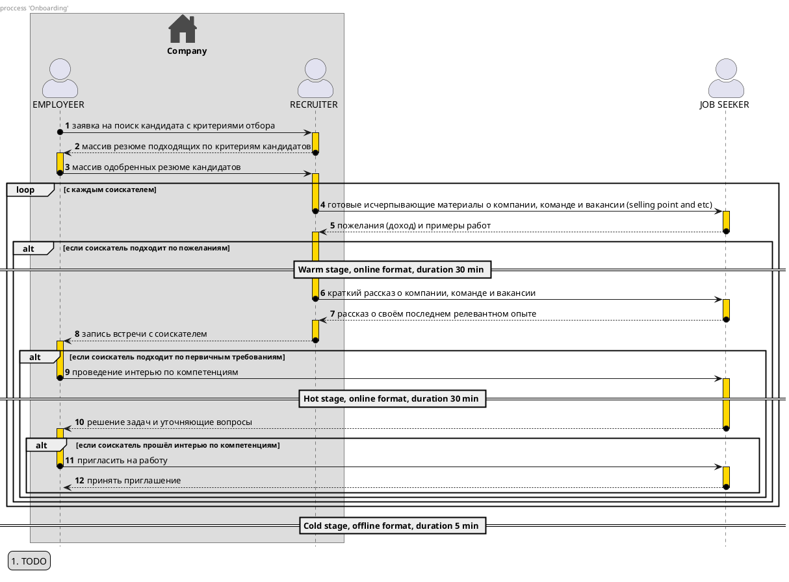

```plantuml
@startuml
!include <office/all>

!procedure $send($source, $destiny, $label='')
    $source o->  $destiny --++ #gold : $label
!endprocedure

!procedure $recv($source, $destiny, $label='')
    $source <--o $destiny --++ #gold : $label
!endprocedure

hide footbox
autonumber
left header proccess 'Onboarding'
skinparam actorStyle awesome

box "<$home>\nCompany"
actor "EMPLOYEER" as dir
actor "RECRUITER" as rec
end box
actor "JOB SEEKER" as emp

$send(dir, rec, 'заявка на поиск кандидата с критериями отбора')
$recv(dir, rec, 'массив резюме подходящих по критериям кандидатов')
$send(dir, rec, 'массив одобренных резюме кандидатов')
loop с каждым соискателем
    $send(rec, emp, 'готовые исчерпывающие материалы о компании, команде и вакансии (selling point and etc)')
    $recv(rec, emp, 'пожелания (доход) и примеры работ')
    alt если соискатель подходит по пожеланиям
        == Warm stage, online format, duration 30 min ==
        $send(rec, emp, 'краткий рассказ о компании, команде и вакансии')
        $recv(rec, emp, 'рассказ о своём последнем релевантном опыте')
        $recv(dir, rec, 'запись встречи с соискателем')
        alt если соискатель подходит по первичным требованиям
            $send(dir, emp, 'проведение интерью по компетенциям')
            == Hot stage, online format, duration 30 min ==
            $recv(dir, emp, 'решение задач и уточняющие вопросы')
            alt если соискатель прошёл интерью по компетенциям
                $send(dir, emp, 'пригласить на работу')
                $recv(dir, emp, 'принять приглашение')
            end
        end
    end
end
== Cold stage, offline format, duration 5 min ==
legend left
    # TODO
endlegend
@enduml
```
