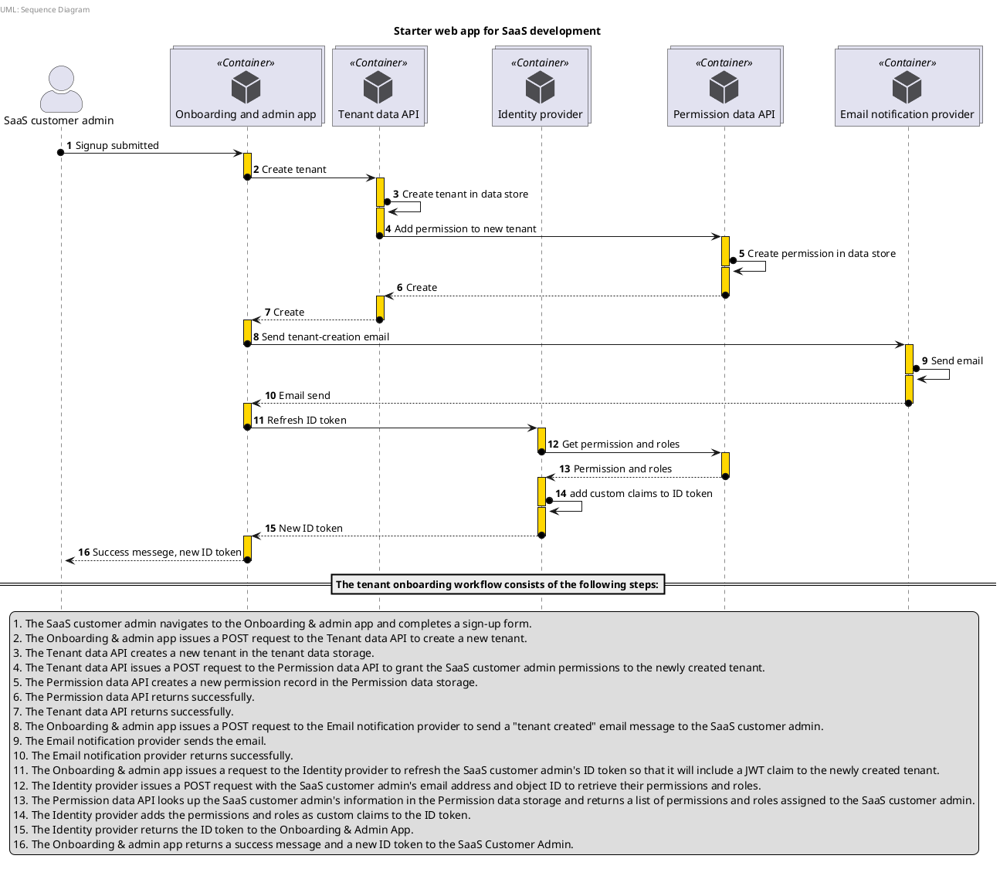

```plantuml
@startuml
!include <office/all>

left header UML: Sequence Diagram
title Starter web app for SaaS development
hide footbox
skinparam actorStyle awesome
!procedure $send($source, $destiny, $label='')
    $source o->  $destiny --++ #gold : $label
!endprocedure

!procedure $recv($source, $destiny, $label='')
    $source <--o $destiny --++ #gold : $label
!endprocedure

!procedure $container($name, $label=$name)
    collections "<$node_generic>\n$label" as $name <<Container>>
!endprocedure

actor "SaaS customer admin" as usr
$container('app', 'Onboarding and admin app')
$container('tapi', 'Tenant data API')
$container('idm', 'Identity provider')
$container('papi', 'Permission data API')
$container('mail', 'Email notification provider')

autonumber
$send(usr, app, 'Signup submitted')
$send(app, tapi, 'Create tenant')
$send(tapi, tapi, 'Create tenant in data store')
$send(tapi, papi, 'Add permission to new tenant')
$send(papi, papi, 'Create permission in data store')
$recv(tapi, papi, 'Create')
$recv(app, tapi, 'Create')
$send(app, mail, 'Send tenant-creation email')
$send(mail, mail, 'Send email')
$recv(app, mail, 'Email send')
$send(app, idm, 'Refresh ID token')
$send(idm, papi, 'Get permission and roles')
$recv(idm, papi, 'Permission and roles')
$send(idm, idm, 'add custom claims to ID token')
$recv(app, idm, 'New ID token')
$recv(usr, app, 'Success messege, new ID token')
==The tenant onboarding workflow consists of the following steps:==
legend left
  # The SaaS customer admin navigates to the Onboarding & admin app and completes a sign-up form.
  # The Onboarding & admin app issues a POST request to the Tenant data API to create a new tenant.
  # The Tenant data API creates a new tenant in the tenant data storage.
  # The Tenant data API issues a POST request to the Permission data API to grant the SaaS customer admin permissions to the newly created tenant.
  # The Permission data API creates a new permission record in the Permission data storage.
  # The Permission data API returns successfully.
  # The Tenant data API returns successfully.
  # The Onboarding & admin app issues a POST request to the Email notification provider to send a "tenant created" email message to the SaaS customer admin.
  # The Email notification provider sends the email.
  # The Email notification provider returns successfully.
  # The Onboarding & admin app issues a request to the Identity provider to refresh the SaaS customer admin's ID token so that it will include a JWT claim to the newly created tenant.
  # The Identity provider issues a POST request with the SaaS customer admin's email address and object ID to retrieve their permissions and roles.
  # The Permission data API looks up the SaaS customer admin's information in the Permission data storage and returns a list of permissions and roles assigned to the SaaS customer admin.
  # The Identity provider adds the permissions and roles as custom claims to the ID token.
  # The Identity provider returns the ID token to the Onboarding & Admin App.
  # The Onboarding & admin app returns a success message and a new ID token to the SaaS Customer Admin.
end legend
@enduml
```
