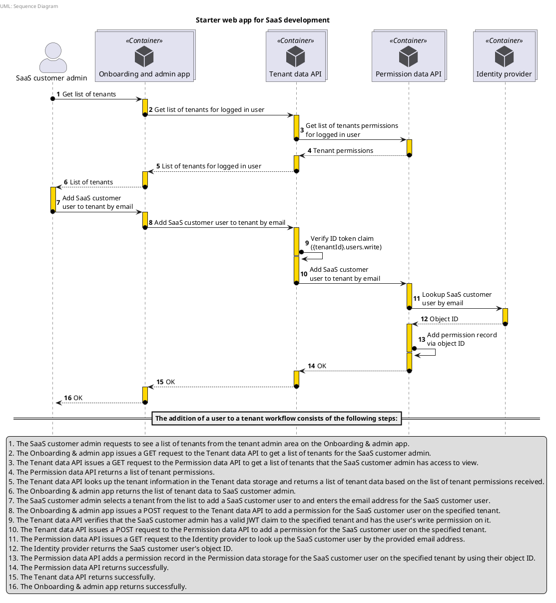

```plantuml
@startuml
!include <office/all>

skinparam actorStyle awesome
!procedure $send($source, $destiny, $label='')
    $source o->  $destiny --++ #gold : $label
!endprocedure

!procedure $recv($source, $destiny, $label='')
    $source <--o $destiny --++ #gold : $label
!endprocedure

!procedure $container($name, $label=$name)
    collections "<$node_generic>\n$label" as $name <<Container>>
!endprocedure

hide footbox
left header UML: Sequence Diagram
title Starter web app for SaaS development

actor "SaaS customer admin" as usr
$container('app', 'Onboarding and admin app')
$container('tapi', 'Tenant data API')
$container('papi', 'Permission data API')
$container('idm', 'Identity provider')

autonumber
$send(usr, app, 'Get list of tenants')
$send(app, tapi, 'Get list of tenants for logged in user')
$send(tapi, papi, 'Get list of tenants permissions\nfor logged in user')
$recv(tapi, papi, 'Tenant permissions')
$recv(app, tapi, 'List of tenants for logged in user')
$recv(usr, app, 'List of tenants')
$send(usr, app, 'Add SaaS customer\nuser to tenant by email')
$send(app, tapi, 'Add SaaS customer user to tenant by email')
$send(tapi, tapi, 'Verify ID token claim\n({tenantId}.users.write)')
$send(tapi, papi, 'Add SaaS customer\nuser to tenant by email')
$send(papi, idm, 'Lookup SaaS customer\nuser by email')
$recv(papi, idm, 'Object ID')
$send(papi, papi, 'Add permission record\nvia object ID')
$recv(tapi, papi, 'OK')
$recv(app, tapi, 'OK')
$recv(usr, app, 'OK')
==The addition of a user to a tenant workflow consists of the following steps:==
legend left
    # The SaaS customer admin requests to see a list of tenants from the tenant admin area on the Onboarding & admin app.
    # The Onboarding & admin app issues a GET request to the Tenant data API to get a list of tenants for the SaaS customer admin.
    # The Tenant data API issues a GET request to the Permission data API to get a list of tenants that the SaaS customer admin has access to view.
    # The Permission data API returns a list of tenant permissions.
    # The Tenant data API looks up the tenant information in the Tenant data storage and returns a list of tenant data based on the list of tenant permissions received.
    # The Onboarding & admin app returns the list of tenant data to SaaS customer admin.
    # The SaaS customer admin selects a tenant from the list to add a SaaS customer user to and enters the email address for the SaaS customer user.
    # The Onboarding & admin app issues a POST request to the Tenant data API to add a permission for the SaaS customer user on the specified tenant.
    # The Tenant data API verifies that the SaaS customer admin has a valid JWT claim to the specified tenant and has the user's write permission on it.
    # The Tenant data API issues a POST request to the Permission data API to add a permission for the SaaS customer user on the specified tenant.
    # The Permission data API issues a GET request to the Identity provider to look up the SaaS customer user by the provided email address.
    # The Identity provider returns the SaaS customer user's object ID.
    # The Permission data API adds a permission record in the Permission data storage for the SaaS customer user on the specified tenant by using their object ID.
    # The Permission data API returns successfully.
    # The Tenant data API returns successfully.
    # The Onboarding & admin app returns successfully.
end legend
@enduml
```
