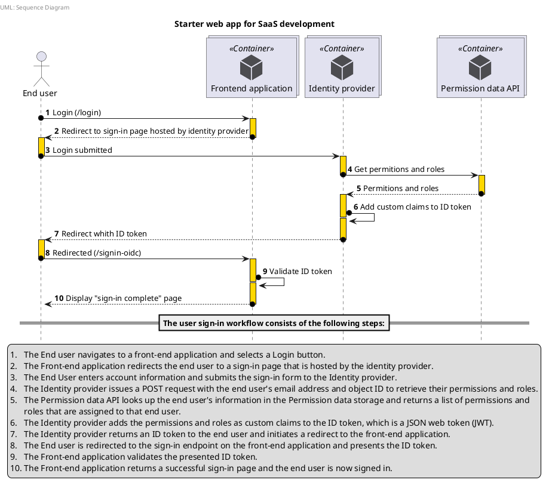

```plantuml
@startuml
!include <office/all>

!procedure $send($source, $destiny, $label='')
    $source o->  $destiny --++ #gold : $label
!endprocedure

!procedure $recv($source, $destiny, $label='')
    $source <--o $destiny --++ #gold : $label
!endprocedure

!procedure $container($name, $label=$name)
    collections "<$node_generic>\n$label" as $name <<Container>>
!endprocedure
hide footbox
left header UML: Sequence Diagram
title Starter web app for SaaS development

actor "End user" as usr
$container(front, 'Frontend application')
$container(idm, 'Identity provider')
$container(api, 'Permission data API')

autonumber
$send(usr, front, 'Login (/login)')
$recv(usr, front, 'Redirect to sign-in page hosted by identity provider')
$send(usr, idm, 'Login submitted')
$send(idm, api, 'Get permitions and roles')
$recv(idm, api, 'Permitions and roles')
$send(idm, idm, 'Add custom claims to ID token')
$recv(usr, idm, 'Redirect whith ID token')
$send(usr, front, 'Redirected (/signin-oidc)')
$send(front, front, 'Validate ID token')
$recv(usr, front, 'Display "sign-in complete" page')
==The user sign-in workflow consists of the following steps:==
legend left
    <#transparent,#transparent>|1. |The End user navigates to a front-end application and selects a Login button.|
    |2. |The Front-end application redirects the end user to a sign-in page that is hosted by the identity provider.|
    |3. |The End User enters account information and submits the sign-in form to the Identity provider.|
    |4. |The Identity provider issues a POST request with the end user's email address and object ID to retrieve their permissions and roles.|
    |5. |The Permission data API looks up the end user's information in the Permission data storage and returns a list of permissions and\nroles that are assigned to that end user.|
    |6. |The Identity provider adds the permissions and roles as custom claims to the ID token, which is a JSON web token (JWT).|
    |7. |The Identity provider returns an ID token to the end user and initiates a redirect to the front-end application.|
    |8. |The End user is redirected to the sign-in endpoint on the front-end application and presents the ID token.|
    |9. |The Front-end application validates the presented ID token.|
    |10. |The Front-end application returns a successful sign-in page and the end user is now signed in.|
endlegend

@enduml
```
