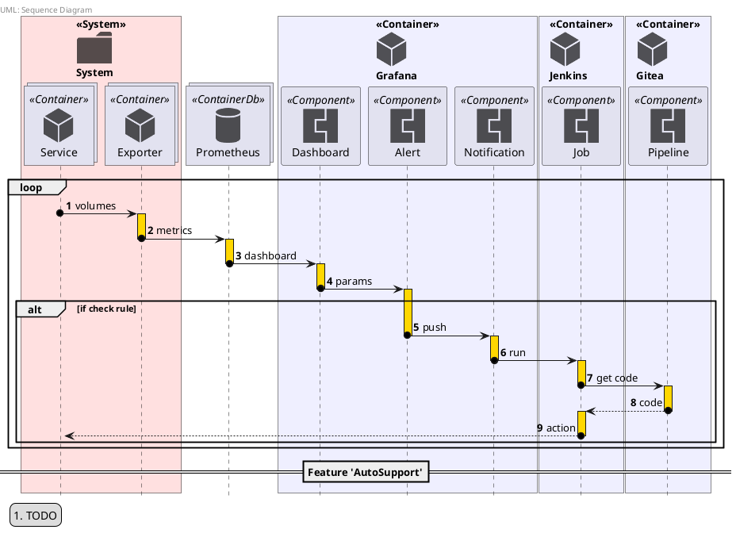

```plantuml
@startuml
!include <office/all>

!procedure $container($name, $label=$name)
    collections "<$node_generic>\n$label" as $name <<Container>>
!endprocedure

!procedure $container_boundary($name, $items)
    box "<<Container>>\n<$node_generic>\n$name" #Motivation
    !foreach $item in %splitstr($items, '~')
        $component($item, $item)
    !endfor
    end box
!endprocedure

!procedure $system_boundary($name, $items)
    box "<<System>>\n<$folder>\n$name" #Implementation
    !foreach $item in %splitstr($items, '~')
        $container($item, $item)
    !endfor
    end box
!endprocedure

!procedure $containerdb($name, $label)
    collections "<$database>\n$label" as $name <<ContainerDb>>
!endprocedure

!procedure $component($name, $label)
    participant "<$integration>\n$label" as $name <<Component>>
!endprocedure

!procedure $send($source, $destiny, $label='')
    $source o->  $destiny --++ #gold : $label
!endprocedure

!procedure $recv($source, $destiny, $label='')
    $source <--o $destiny --++ #gold : $label
!endprocedure

hide footbox
skinparam sequenceMessageAlign direction
autonumber
left header UML: Sequence Diagram

$system_boundary(System, 'Service~Exporter')
$containerdb(db, Prometheus)
$container_boundary(Grafana, 'Dashboard~Alert~Notification')
$container_boundary(Jenkins, 'Job')
$container_boundary(Gitea, 'Pipeline')

loop
    $send(Service, Exporter, volumes)
    $send(Exporter, db, metrics)
    $send(db, Dashboard, dashboard)
    $send(Dashboard, Alert, params)
    alt if check rule
        $send(Alert, Notification, push)
        $send(Notification, Job, run)
        $send(Job, Pipeline, 'get code')
        $recv(Job, Pipeline, 'code')
        $recv(Service, Job, 'action')
    end
end
==Feature 'AutoSupport'==
legend left
    # TODO
end legend
@enduml
```
